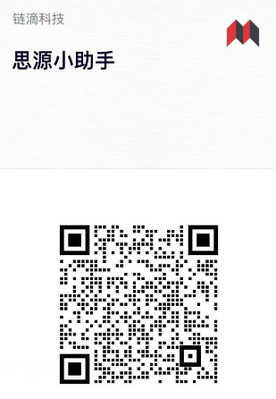

# 收集箱

## 概述

我们可以通过云端收集箱对外部数据进行收集，然后在思源中通过收集箱面板从云端获取这些数据并发送到笔记本中进行进一步整理。

## 使用方式

目前提供以下两种方式进行数据接入。

### 微信输入

1. 在 [链滴 - 设置 - 账号](https://ld246.com/settings/account) 中绑定微信
2. 关注 `B3log开源` 公众号

    ​
3. 关注后点击右下角绑定账号
4. 对该公众号发送消息（可从收藏中选择待发送消息），仅支持文本、图片和超链接
5. 在思源中打开收集箱面板（Alt+6）

关注公众号并绑定账号后除了可以通过公众号输入，也可以通过添加 `思源小助手` 为联系人后输入，这样可以直接转发聊天记录。



支持的消息类型为文本、图片、语音、视频和文件，单个图片、语音、视频和文件的大小不超过 20MB。

​#注意#​：

* 仅限订阅会员使用，未订阅或者订阅过期后联系人关系会被删除

### API

* POST `https://ld246.com/apis/siyuan/inbox/addCloudShorthand`
* Body

  ```json
  {
      "title": "A simple text title",
      "content": "Content with **Markdown**."
  }
  ```
* 鉴权方式为 HTTP 请求标头 `Authorization`，值为 `token {Your API Token}`（注意大小写和空格），API Token 可以 [链滴 - 设置 - 账号](https://ld246.com/settings/account) 中找到

​#注意#​：

* 频率限制：每 24 小时最多插入 128 条

‍
